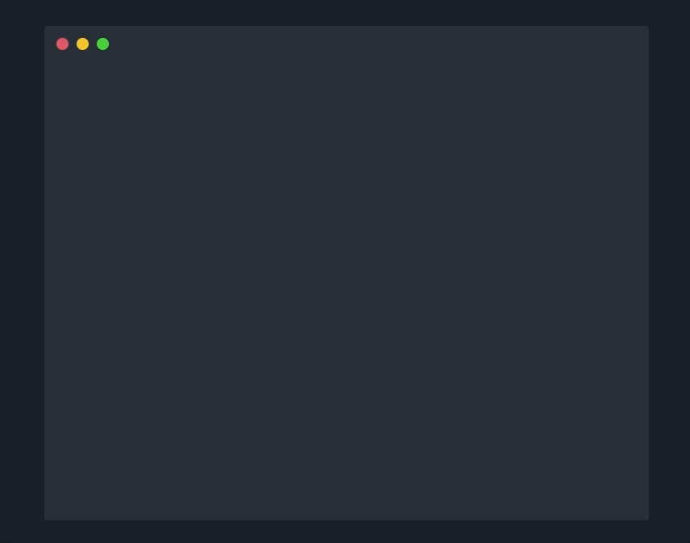

# Vue-Termynal

Vue-Termynal is the reimplementation of the [termynal library](https://github.com/ines/termynal) in Vue.js.

It lets you create animated teminal windows with simple, customizable vue components.

## Documentation

https://lehoczky.github.io/vue-termynal/

## Example

```html
<v-termynal>
  <vt-input>pip install spacy</vt-input>
  <vt-progress />
  <vt-text>Successfully installed spacy</vt-text>
  <vt-text></vt-text>
  <vt-input>python -m spacy download en</vt-input>
  <vt-progress />
  <vt-text>Installed model 'en'</vt-text>
  <vt-text></vt-text>
  <vt-input>python</vt-input>
  <vt-input prompt=">>>">import spacy</vt-input>
  <vt-input prompt=">>>">nlp = spacy.load('en')</vt-input>
  <vt-input prompt=">>>">doc = nlp(u'Hello world')</vt-input>
  <vt-input prompt=">>>">print([(w.text, w.pos_) for w in doc])</vt-input>
  <vt-text>[('Hello', 'INTJ'), ('world', 'NOUN')]</vt-text>
</v-termynal>
```



A more customized window:


